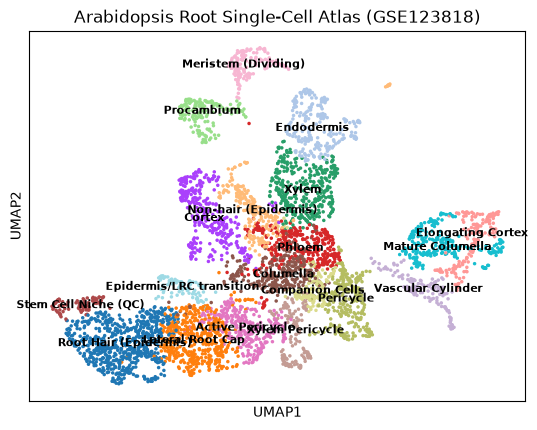

# 拟南芥根部单细胞转录组分析 (Scanpy)
## Arabidopsis Root Single-Cell RNA-seq Atlas (GSE123818)

本项目使用Scanpy库，对拟南芥单细胞数据集（GSE123818）进行了完整的过滤、标准化、降维（PCA/UMAP）、聚类（Leiden）以及细胞类型鉴定

### 🔬 细胞群鉴定一览 (Cell Type Annotation)
本项目成功在 4,727 个高质量细胞中区分出了 19 个高度特异性的细胞亚群，涵盖了根部几乎所有核心组织：
*   **Epidermis**: Root Hair (Cluster 0), Non-hair (Cluster 10)
*   **Cortex**: Cortex (Cluster 4), Elongating Cortex (Cluster 12)
*   **Endodermis**: (Cluster 9 - CASP1+ 凯氏带细胞)
*   **Pericycle**: Pericycle (Cluster 7), Active Pericycle (Cluster 6)
*   **Vascular**: Xylem (Cluster 2), Phloem (Cluster 3), Companion Cells (Cluster 16)
*   **Root Cap**: Lateral Root Cap (Cluster 1), Columella (Cluster 5, 8)
*   **Stem Cell Niche**: Stem Cell Niche / QC (Cluster 18)

